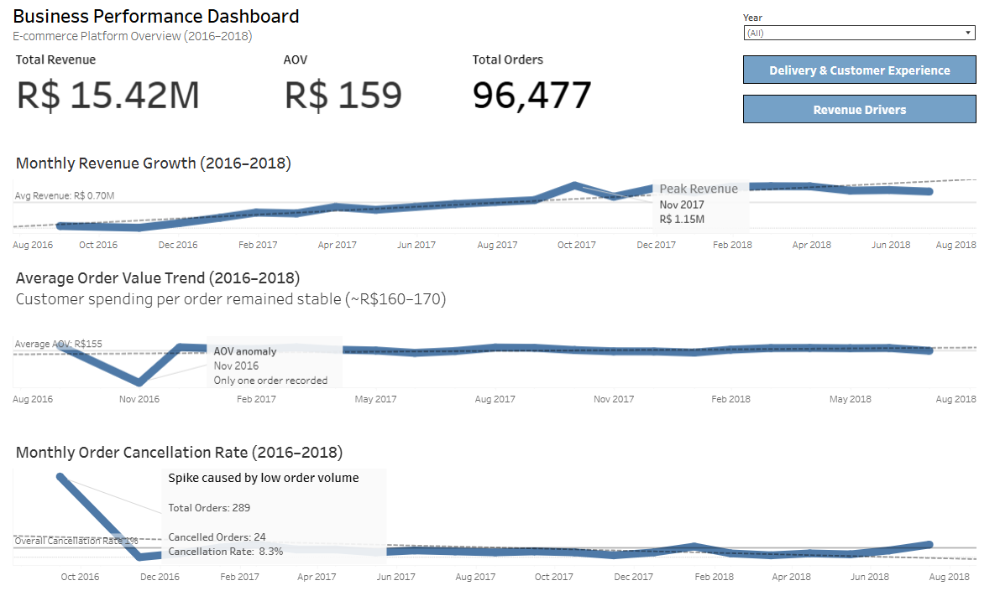

## Business Performance Dashboard  

🔗 View Interactive Dashboard on Tableau Public:
https://public.tableau.com/shared/27T87Q7BH?:display_count=n&:origin=viz_share_link

**Overview:**  
This dashboard provides a high-level view of business performance from 2016 to 2018, focusing on revenue trends, customer spending behavior, and order stability.

---

## Key Metrics  

- Total Revenue  
- Average Order Value (AOV)  
- Total Orders  

---

## Analysis  

### Monthly Revenue Growth (2016–2018)  
Revenue shows a steady upward trend, with a noticeable peak in November 2017.

### Average Order Value Trend (2016–2018)  
Customer spending per order remained relatively stable, averaging approximately R$155–R$170.

### Monthly Order Cancellation Rate (2016–2018)  
Cancellation rates fluctuate slightly over time but remain relatively low overall, around 1%.

---

## Key Takeaway  

Revenue growth is primarily driven by increased order volume rather than higher spending per order, while cancellation rates remain stable.
