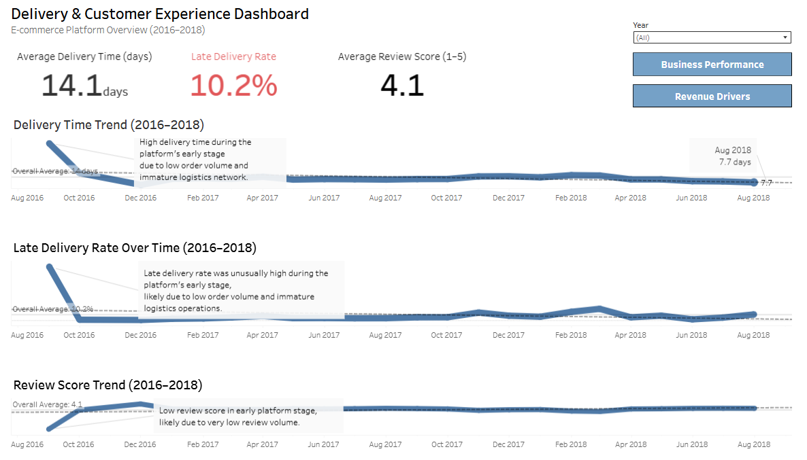

## Delivery & Customer Experience Dashboard  

**Overview:**  
This dashboard evaluates delivery performance and customer satisfaction from 2016 to 2018, highlighting trends in delivery time, late delivery rates, and review scores.

---

## Key Metrics  

- Average Delivery Time (days)  
- Late Delivery Rate  
- Average Review Score (1–5)  

---

## Analysis  

### Delivery Time Trend (2016–2018)  
Delivery time was relatively high during the early stage of the platform, then decreased and stabilized over time.

### Late Delivery Rate Over Time (2016–2018)  
Late delivery rates were higher during the early stage, likely due to lower order volume and less developed logistics operations, then became more stable.

### Review Score Trend (2016–2018)  
Customer review scores remained relatively consistent around 4.0–4.2 throughout the period.

---

## Key Takeaway  

Delivery performance improved after the platform’s early stage, while customer satisfaction remained consistently high.
