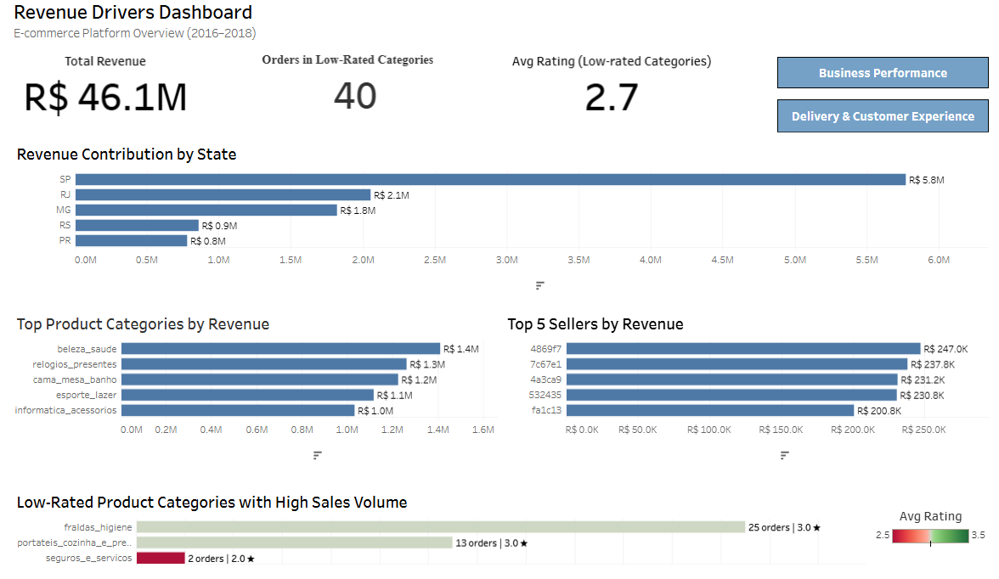

## Revenue Drivers Dashboard  

**Overview:**  
This dashboard identifies key contributors to revenue by analyzing geographic distribution, product categories, sellers, and product performance.

---

## Key Metrics  

- Total Revenue  
- Orders in Low-Rated Categories  
- Average Rating (Low-rated Categories)  

---

## Analysis  

### Revenue Contribution by State  
A small number of states contribute the majority of total revenue, with São Paulo (SP) leading significantly.

### Top Product Categories by Revenue  
Revenue is concentrated among a few product categories, with the top categories generating the highest sales.

### Top 5 Sellers by Revenue  
A limited number of sellers account for a significant portion of revenue.

### Low-Rated Product Categories with High Sales Volume  
Some product categories show relatively high sales volume despite lower average ratings.

---

## Key Takeaway  

Revenue is concentrated among a small number of states, categories, and sellers, while some high-performing categories with lower ratings may indicate potential risks to customer satisfaction.
